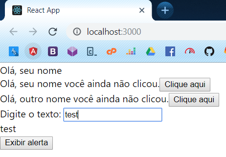
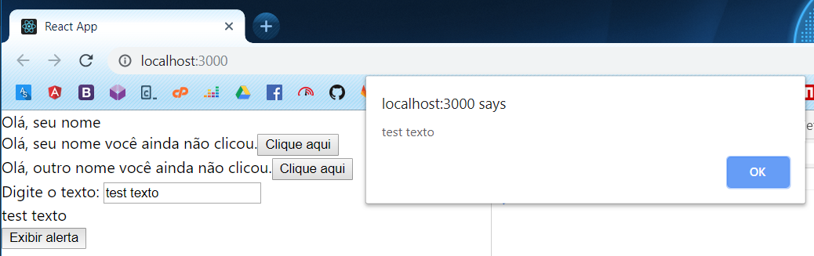

# Formulários

Já vimos como funciona o JSX, sistema de props, state e eventos, agora como podemos receber inputs do usuário?

Diferente do Angular e Vue.js, o React não possui sistema de data binding de formulários integrados ao template, ele é fortemente baseado em JavaScript, no entando podemos simular isto atribuindo eventos de onChange a campos de texto, checkbox, radio buttons, etc, e então alterar o estado do componente com o ovo valor.

Crie o arquivo **src/HelloForm.js** e adicione o código a seguir:

```jsx
import React from 'react';

class HelloForm extends React.Component {
    state = {
        texto: ''
    };

    handleTextChange(e) {
        this.setState({
            texto: e.target.value
        });
    }

    handleClick() {
        alert(this.state.texto);
    }

    render() {
        return (
            <div>
                Digite o texto: <input type="text" onChange={this.handleTextChange.bind(this)}></input>
                <div>{this.state.texto}</div>
                <button onClick={this.handleClick.bind(this)}>Exibir alerta</button>
            </div>
        )
    }
}

export default HelloForm;
```

Agora deixe nosso **src/App.js** assim:

```jsx
import React from 'react';
import HelloStateless from './HelloStateless';
import HelloStateful from './HelloStateful';
import HelloForm from './HelloForm';

function App() {
  return (
    <div>
        <HelloStateless nome="seu nome"></HelloStateless>
        <HelloStateful nome="seu nome"></HelloStateful>
        <HelloStateful nome="outro nome"></HelloStateful>
        <HelloForm></HelloForm>
    </div>
  );
}

export default App;
```

Quando você digitar algo nesse campo de texto, o valor dele já vai ser exibido embaixo, como na imagem a seguir:



Como alteramos o estado, podemos utilizar o mesmo em qualquer lugar do componente, como por exemplo no evento de clique:



Note que sempre que alteramos o valor do campo de texto o método `handleTextChange` é executado, e então podemos atribuir o novo valor do campo de texto no estado do componente e utilizar ele onde quisermos no mesmo. 

## Métodos como props

Outra coisa que podemos fazer e é bem comum no mundo React é passar funções como props, assim podemos emitir um eventos no componente pai pelo componente filho:

Deixe nosso arquivo **src/App.js** assim:

```jsx
import React from 'react';
import HelloStateless from './HelloStateless';
import HelloStateful from './HelloStateful';
import HelloForm from './HelloForm';

class App extends React.Component {
    exibirAlerta(texto) {
        alert('[App.js] ' + texto)
    }

    render() {
        return (
            <div>
                <HelloStateless nome="seu nome"></HelloStateless>
                <HelloStateful nome="seu nome"></HelloStateful>
                <HelloStateful nome="outro nome"></HelloStateful>
                <HelloForm exibeAlerta={this.exibirAlerta}></HelloForm>
            </div>
        );
    }
}

export default App;
```

E nosso **src/HelloForm.js** assim:

```jsx
import React from 'react';

class HelloForm extends React.Component {
    state = {
        texto: ''
    };

    handleTextChange(e) {
        this.setState({
            texto: e.target.value
        });
    }

    handleClick() {
        this.props.exibeAlerta(this.state.texto);
    }

    render() {
        return (
            <div>
                Digite o texto: <input type="text" onChange={this.handleTextChange.bind(this)}></input>
                <div>{this.state.texto}</div>
                <button onClick={this.handleClick.bind(this)}>Exibir alerta</button>
            </div>
        )
    }
}

export default HelloForm;
```

Note que agora ao clicarmos no botão, a função passada via prop é executada, assim você pode utilizar o valor digitado no componente `HelloForm` no seu componente `App`.
