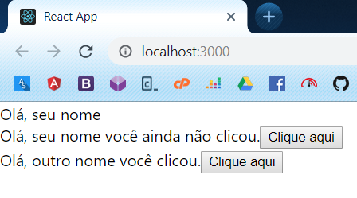
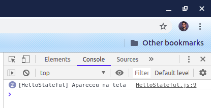

# Componentes Stateful

Agora crie o arquivo **src/HelloStateful.js**, e cole o código abaixo:

```jsx
import React from 'react'; 

class HelloStateful extends React.Component {
    state = {
        clicou: 'ainda não clicou'
    }

    handleClick() {
        this.setState({
            clicou: 'clicou'
        });
    }

    render() {
        return (
            <div>
                Olá, {this.props.nome} você {this.state.clicou}.

                <button onClick={this.handleClick.bind(this)}>Clique aqui</button>
            </div>
        );
    }
}

export default HelloStateful;
```

Agora cole o código abaixo no **src/App.js**.

```jsx
import React from 'react';
import HelloStateless from './HelloStateless';
import HelloStateful from './HelloStateful';

function App() {
  return (
    <div>
        <HelloStateless nome="seu nome"></HelloStateless>
        <HelloStateful nome="seu nome"></HelloStateful>
        <HelloStateful nome="outro nome"></HelloStateful>
    </div>
  );
}

export default App;
```

Esse é um exemplo de componente _stateful_, note que é uma classe JavaScript que herda da classe `React.Component` (sim, requer um pouco de conhecimento em orientação a objetos para entender isso), nela podemos adicionar funções (métodos) como a gente quiser e atribui-las em eventos de click, change, etc do nosso componente.

Note o state (ou estado) do componente, nele podemos alterar como quisermos variáveis para apenas o componente que houve a interação, independente dos outros componentes de mesmo nome.

Note que com o código acima, é exibido isto no navegador:



Foi exibido duas vezes o conteúdo de `HelloStateful` pois utilizamos a "tag" do mesmo duas vezes no nosso App.js, note também que ao clicar no segundo botão, o conteúdo fica assim:



Isso ocorre pois alteramos o estado do componente ao clicar no botão dele, declaramos o estado inicial utilizando a propriedade `state` da classe atribuindo a um objeto com o nome dos estados que você deseja (`clicou` é um deles), e utilizamos o método `setState` dos componentes stateful (que utilizam classes) para alterar esse estado inicial.

No JSX fazemos atribuições utilizando a sintaxe `atributo={variavel}`, assim mesmo, utilizando chaves ao invés de aspas, assim você pode atribuir eventos como fizemos no último código e até passar o estado do componente pai para o filho utilizando as props.

Note também que não usamos `onclick` e sim `onClick`, por padrão eventos no React são declarados em camelCase, assim atribuimos o evento `onClick` no botão ao método `handleClick` da classe.
