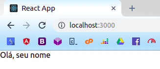

# Componentes Stateless

Crie o arquivo **src/HelloStateless.js** e cole o código a seguir:

```jsx
import React from 'react';

function HelloStateless(props) {
    return <div>Olá, {props.nome}</div>
}

export default HelloStateless;
```

A primeira linha é necessária para podermos utilizar JSX no arquivo, agora deixe o seu App.js assim:

```jsx
import React from 'react';
import HelloStateless from './HelloStateless';

function App() {
  return (
    <div>
        <HelloStateless nome="seu nome"></HelloStateless>
    </div>
  );
}

export default App;
```

Deve estar exibindo algo assim no seu navegador:



No código acima você já pôde ver como declarar um componente stateless e como utilizá-lo em outro componente, basicamente utilizar a sintaxe de importação de módulos do JavaScript e usá-lo em outro JSX como se fosse uma tag HTML normal.

Também utilizamos o sistema de props, que podemos adicionar atributos customizados no nosso componente e tratar como quisermos dentro do mesmo.
