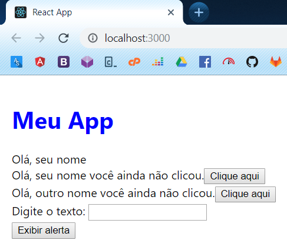
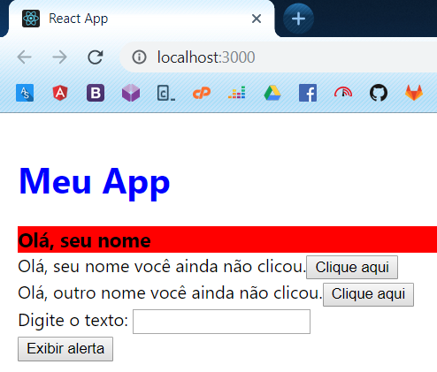

# Estilos

No React existem diversas soluções para tratar estilos, como o [styled componentes](https://github.com/styled-components/styled-components).

Você pode adicionar arquivos CSS normalmente no seu projeto e importa-los no seu JavaScript para adicioná-los no seu componente, o sistema de build do React (Webpack) sabe como interpretar esse CSS e adicioná-lo em um arquivo .css separado e otimizado após o processo de transpilação.

Ao criar o projeto foi criado um arquivo **src/App.css**, adicione o código a seguir nele:

```css
.App {
  padding: 16px;
}

.App .meu-app {
  color: #0000ff;
}
```

E então adicione o seguinte o código no **src/App.js**:

```jsx
import React from 'react';
import HelloStateless from './HelloStateless';
import HelloStateful from './HelloStateful';
import HelloForm from './HelloForm';

import './App.css';

class App extends React.Component {
    exibirAlerta(texto) {
        alert('[App.js] ' + texto)
    }

    render() {
        return (
            <div className="App">
                <h1 className="meu-app">Meu App</h1>
                <HelloStateless nome="seu nome"></HelloStateless>
                <HelloStateful nome="seu nome"></HelloStateful>
                <HelloStateful nome="outro nome"></HelloStateful>
                <HelloForm exibeAlerta={this.exibirAlerta}></HelloForm>
            </div>
        );
    }
}

export default App;
```

Este deve ser o resultado no navegador:



Lembra que JSX no fundo não são tags HTML e sim JavaScript? Por isso não podemos utilizar `class` para indicar classes CSS nos elementos JSX pois é uma palavra reservada e com conceito completamente no JavaScript (utilizamos ela para iniciar nosso componente stateful), por isso devemos utilizar `className` para referenciar classes CSS em elementos JSX.

Você também pode utilizar estilos inline no React, no entanto eles são objetos JavaScript ao invés de um simples texto.

Acesse nosso **src/HelloStateless.js** e deixe com o código abaixo:

```jsx
import React from 'react';

function HelloStateless(props) {
    return (
        <div
            style={{ fontWeight: 'bold', fontSize: '18px', backgroundColor: '#ff0000' }}
        >
            Olá, {props.nome}
        </div>
    )
}

export default HelloStateless;
```

No navegador deve estar assim:



Note que utilizamos `style={{}}`, a primeira chaves indica que estamos atribuindo algo ao JSX, igual atribuimos um evento na última página, já a segunda indica um objeto JSON normal.
