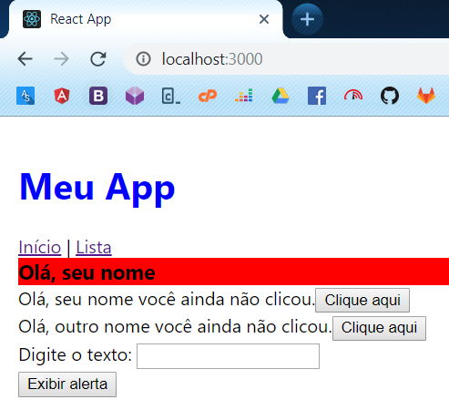
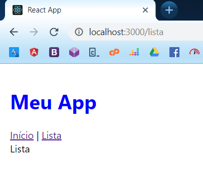

# Router

Já notou que em muitas aplicações web modernas, como o Facebook e Twitter, você muda de páginas clicando em link mas a página não recarrega totalmente? Geralmente apenas o centro da aplicação muda, mas as barras superior e lateral nem sequer piscam ao mudar de página, isso ocorre por causa do sistema de rotas.

Tanto a aplicação web do Facebook quanto a do Twitter, Outlook, Netflix e vários outros serviços famosos são realmente escritas em React da mesma forma que aprendemos até chegar até aqui, e todas elas possuem isso em comum.

O nome disso é chamado sistema de rotas, que te permite atribuir um componente React a uma url/link, e mudar apenas o necessário na página para exibi-lo, esse conceito também é um dos pilares de frameworks como Angular e Vue.js, as principais vantagens são o ganho de perfomance e em experiência do usuário, pois seu contúdo vai carregar mais rapidamente.

Vamos começar a implementar uma sistema de rotas com dois componentes React, para isso utilizaremos o [`react-router`](https://reacttraining.com/react-router/web/guides/quick-start), que é o pacote mais famoso e completamente mantido pela comunidade, para iniciar, abra o terminal no diretório do nosso projeto (onde está o arquivo `package.json`) e rode o seguinte comando:

```
npm install react-router-dom
```

Em seguida iremos montar componentes para representar nossas páginas, primeiro criaremos um componente **src/Home.js** para representar nossa página inicial, a ideia é que nele exibiremos o que fizemos até agora, e o **src/List.js**, que exibirá uma lista que receberemos a partir de uma API, já o **src/App.js** ficará administrando nossas rotas e conterá as áreas da nossa aplicação que nunca mudam, como o header da mesma.

Crie o arquivo **src/Home.js** e adione o códigos abaixo:

```jsx
import React from 'react';
import HelloStateless from './HelloStateless';
import HelloStateful from './HelloStateful';
import HelloForm from './HelloForm';

class Home extends React.Component {
    exibirAlerta(texto) {
        alert('[Home.js] ' + texto)
    }

    render() {
        return (
            <div>
                <HelloStateless nome="seu nome"></HelloStateless>
                <HelloStateful nome="seu nome"></HelloStateful>
                <HelloStateful nome="outro nome"></HelloStateful>
                <HelloForm exibeAlerta={this.exibirAlerta}></HelloForm>
            </div>
        );
    }
}

export default Home;
```

Em seguida crie o arquivo **src/List.js**, que por enquanto ficará assim:

```jsx
import React from 'react';

class List extends React.Component {
    render() {
        return (
            <div>
                Lista
            </div>
        );
    }
}

export default List;
```

Deixaremos como um stateful pois adicionaremos mais conteúdo daqui a pouco.

Já o nosso **src/App.js** ficará assim:

```jsx
import React from 'react';
import { BrowserRouter, Route, Link } from 'react-router-dom';

import './App.css';

import Home from './Home';
import List from './List';

class App extends React.Component {
    render() {
        return (
            <BrowserRouter>
                <div className="App">
                    <h1 className="meu-app">Meu App</h1>

                    <Link to="/">Início</Link> | <Link to="/lista">Lista</Link>
                    
                    <Route path="/" exact component={Home}></Route>
                    <Route path="/lista" component={List}></Route>
                </div>
            </BrowserRouter>
        );
    }
}

export default App;
```

Se tudo der certo, no navegador ficará assim:



E após clicar em Lista, a página ficará assim:



Note que o conteúdo é exibido de acordo com a URL exibida na barra de endereços e ao clicar nos links, as páginas não é recarregada.

Para começar a utilizar o react-router nós encapsulamos nossa aplicação dentro do componente `BrowserRouter`, que vai ser o responsável por inicializar o plugins de rotas, e então declaramos com o componente `Route` a nossa lista de urls e quais componentes devem ser exibidos quando a mesma for acessada, já o componente `Link` serve para fazermos links internos da nossa aplicação utilizando o sistema de rotas, caso você utilize um simples `<a>`, o react-router não será utilizado e haverá a percepção de reload da página. 
